# 🎬 MovieTime

MovieTime is an Android app built with **Jetpack Compose**, **MVVM**, and **Clean Architecture**. It showcases trending and now playing movies, allows users to bookmark favorites, search for movies, and deep-link directly to movie details screen.

## 🚀 Features

- 📺 Home screen with Trending & Now Playing movies
- 🔍 Search for movies
- ⭐ Bookmark/save favorite movies
- 🎞️ Detailed Movie Info
- 📤 Shareable deep links to movie detail screen
- 💾 Offline support using Room
- 🧼 Clean Architecture (Presentation, Domain, Data layers)

## 🧠 Tech Stack

- Kotlin
- MVVM + Clean Architecture
- Jetpack Compose
- Coroutines + Flow
- Navigation Component
- Hilt for DI
- Retrofit for API
- Room for local storage
- Coil for image loading

## 🔗 Deep Linking
To test the deep linking, run the following command in terminal

```bash
adb shell am start -a android.intent.action.VIEW \
  -d "https://movietime.fake/movie/{movieId}" \
  com.nikhil.movietime
```

## 📸 Screenshots

### Home Screen
<p align="center">
  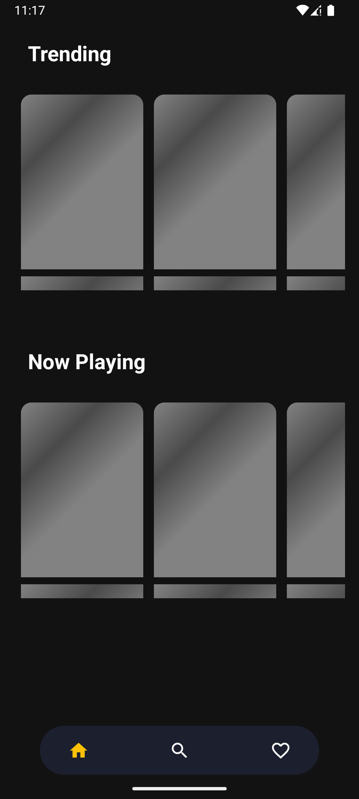
  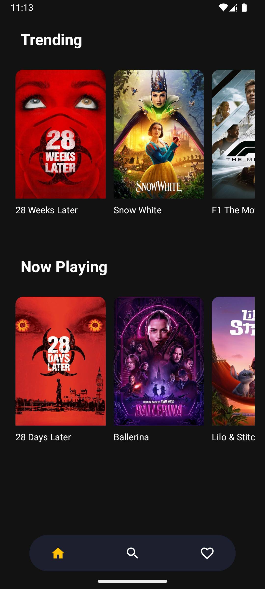
  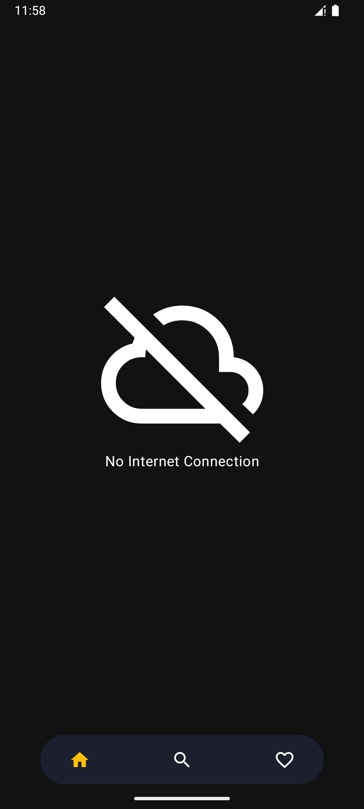
</p>

### Movie Detail Screen
<p align="center">
  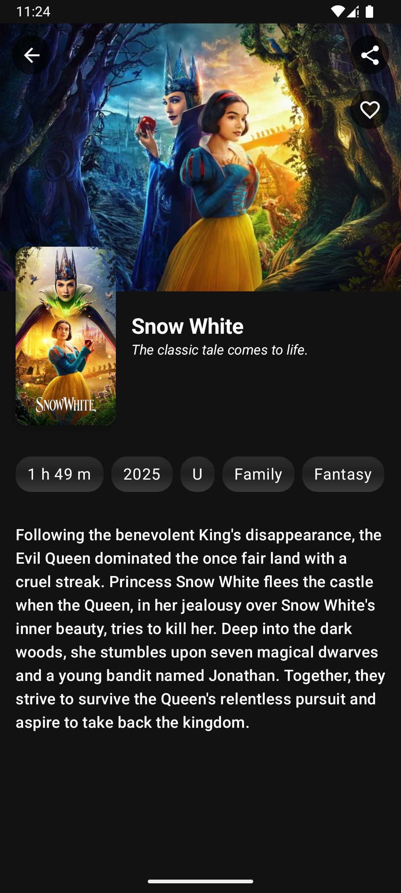
  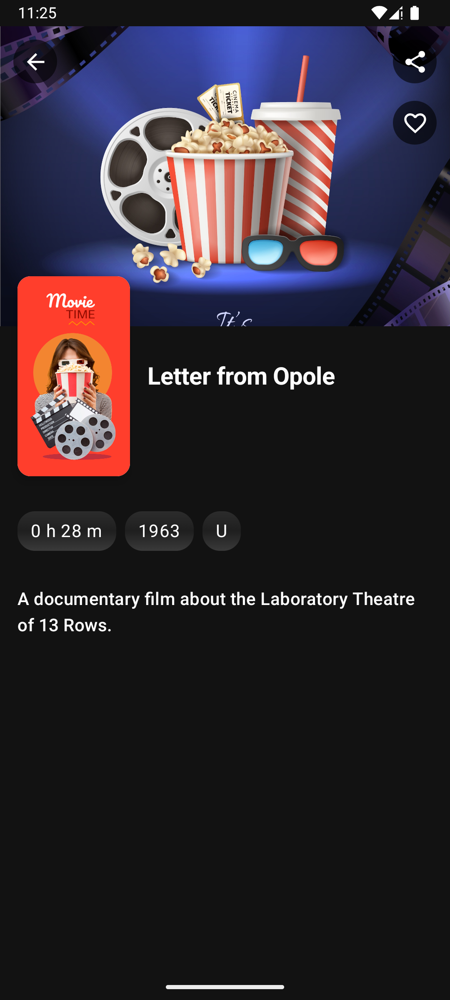
</p>

### Search Screen
<p align="center">
  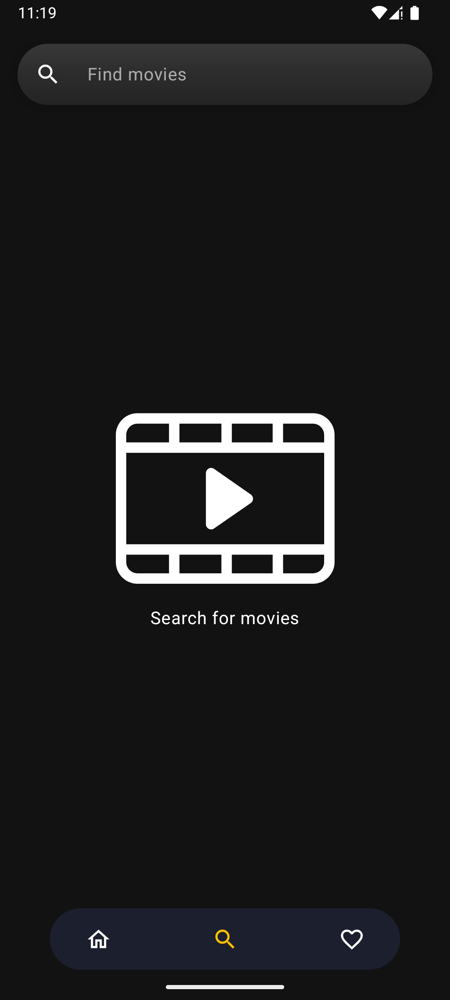
  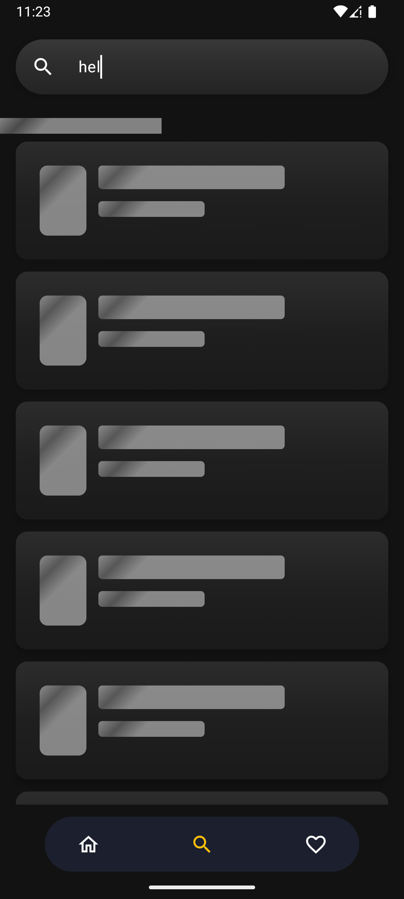
  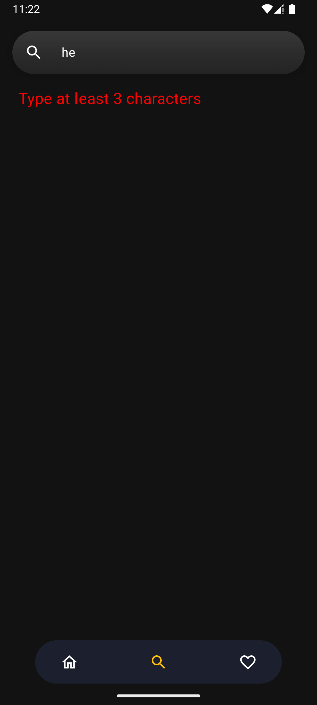
</p>
<p align="center">
  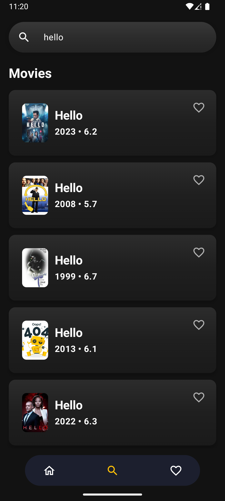
  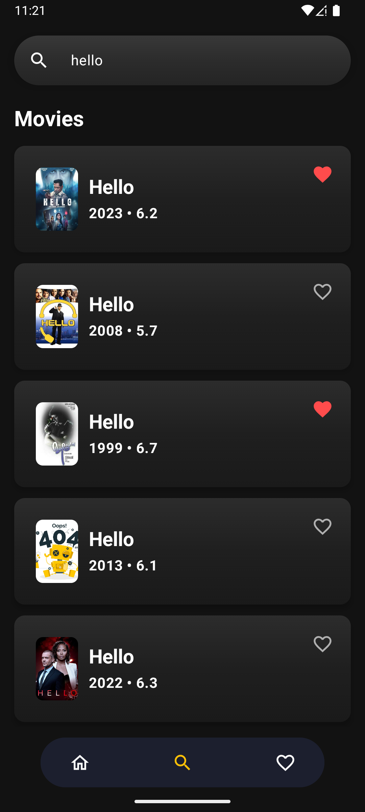
  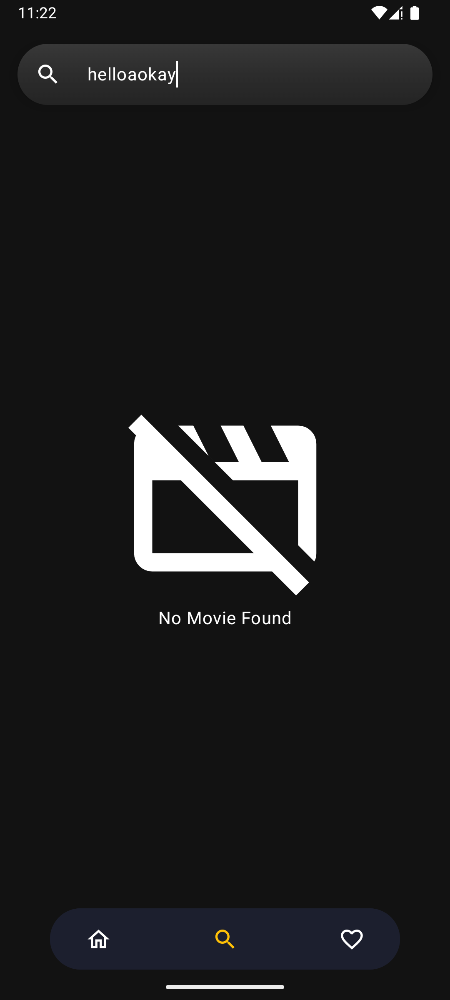
</p>

### Favorite Screen
<p align="center">
  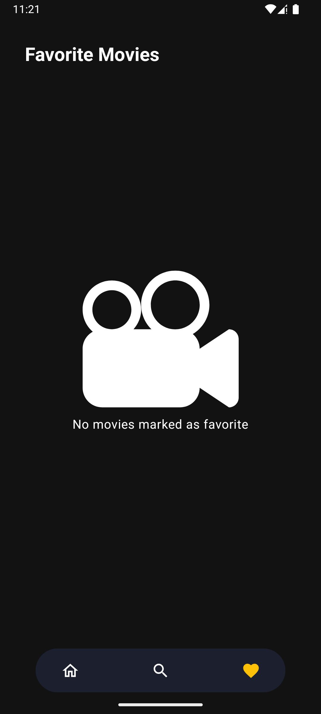
  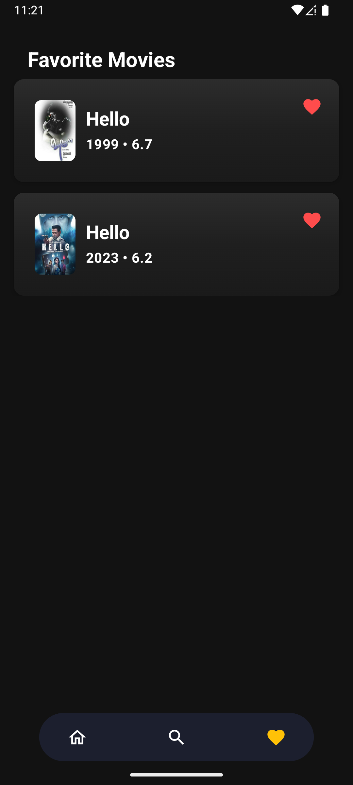
</p>
